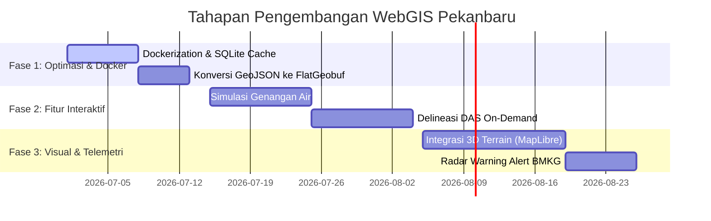

# Rencana Pengembangan & Penyebaran (Deployment Plan) WebGIS Pekanbaru

Dokumen ini memuat rencana jangka panjang untuk menyebarkan (*deploy*) WebGIS Pekanbaru seringan mungkin (efisien sumber daya), dengan performa tinggi, serta penambahan fitur analisis hidrologi yang maksimal.

---

## 1. Arsitektur Penyebaran Ringan & Efisien (Lightweight Deployment)

Untuk menjaga penggunaan RAM tetap di bawah **500MB** (sehingga bisa dijalankan di VPS gratisan/murah seperti Fly.io, Railway, or AWS EC2 Micro), kita perlu mereduksi ukuran dependensi dan memori:

### A. Dockerization dengan OSGeo Base Image
GDAL, PROJ, dan Rasterio sangat sulit dikompilasi secara manual dan seringkali menghasilkan ukuran image Docker yang sangat besar (~2GB+). 
* **Solusi**: Gunakan image resmi OSGeo yang sudah dioptimalkan untuk ukuran kecil:
  `ghcr.io/osgeo/gdal:ubuntu-small-latest` (hanya ~300MB, sudah include GDAL CLI & Python bindings).

```dockerfile
FROM ghcr.io/osgeo/gdal:ubuntu-small-latest

# Install Python & Pip
RUN apt-get update && apt-get install -y python3-pip python3-venv && rm -rf /var/lib/apt/lists/*

WORKDIR /app
COPY requirements.txt .
RUN pip3 install --no-cache-dir -r requirements.txt

COPY . .
CMD ["gunicorn", "--bind", "0.0.0.0:8080", "--workers", "2", "--worker-class", "gevent", "server:app"]
```

### B. Optimasi Database & Penyimpanan Vector
Berkas `.geojson` seperti `streams.geojson` (28MB) dan `contours_1m_simple.geojson` (62MB) terlalu membebaskan RAM server jika terus di-parsing menggunakan Python `json.load`.
* **Solusi**:
  1. **PMTiles atau FlatGeobuf**: Ganti GeoJSON dengan format **FlatGeobuf** (`.fgb`) atau **PMTiles**. Format ini mendukung query spasial langsung dari berkas tanpa membaca seluruh konten berkas ke memori RAM (*zero-copy reading*).
  2. **SQLite / SpatiaLite**: Pindahkan data sungai dan kontur ke database SQLite satu berkas yang ringan. Kita bisa menggunakan ekstensi spasial **SpatiaLite** untuk query spasial yang sangat cepat dengan konsumsi memori mendekati 0.

### C. Persistent Tile Cache (SQLite-Based Cache)
Ubin peta (*map tiles*) yang dirender dari DEM dan kontur saat ini disimpan di memori (`LRUCache`). Jika server restart, cache terhapus dan CPU harus merender ulang.
* **Solusi**: Gunakan SQLite sebagai penyimpanan cache ubin (*Persistent Tile Cache*). SQLite sangat cepat untuk baca/tulis biner (PNG) berukuran kecil, bersifat *thread-safe*, dan tidak mengonsumsi RAM karena disimpan di disk.

---

## 2. Fitur Maksimal untuk Analisis Hidrologi (Maximum Features)

Untuk menghadirkan visualisasi dan analisis kelas premium, berikut fitur-fitur yang direncanakan:

### A. Delineasi DAS On-Demand (Interactive Catchment Delineation)
* **Konsep**: Pengguna dapat mengklik titik mana saja di peta (sebagai *pour point*), dan server akan menghitung batas daerah aliran sungai (DAS) mikro di atas titik tersebut secara *real-time* menggunakan PySheds.
* **Teknis**: Jalankan algoritma PySheds di *background thread* Flask, lalu kembalikan batas DAS dalam bentuk GeoJSON dinamis ke Leaflet.

### B. Simulasi Genangan Air Interaktif (Precipitation Inundation Simulator)
* **Konsep**: Slider interaktif curah hujan (misal: 50mm, 100mm, 200mm). Pengguna dapat mensimulasikan daerah mana saja yang akan tergenang berdasarkan tinggi genangan teoritis.
* **Teknis**: Manfaatkan berkas `dem_sinkdiff_4326.tif` (selisih elevasi asli dengan elevasi *sink fill*). Jika kedalaman depresi (*sink depth*) kurang dari nilai curah hujan yang dimasukkan, tampilkan visualisasi genangan air di peta dengan opacity biru.

### C. Visualisasi 3D Terrain (3D Watershed Viewer)
* **Konsep**: Tombol "Lihat 3D" untuk melihat relief Pekanbaru dan aliran sungai Siak secara tiga dimensi langsung di browser.
* **Teknis**: Integrasikan **MapLibre GL JS** dengan DEM Terrain RGB tiles atau menggunakan pustaka **Three.js** / **CesiumJS** ringan untuk merender jaring-jaring 3D (*3D mesh*) ketinggian Pekanbaru.

### D. Sistem Peringatan Dini Banjir (Flood Early Warning Alert)
* **Konsep**: Notifikasi peringatan dini jika wilayah hulu DAS Siak diprediksi menerima curah hujan ekstrem dalam 2 jam ke depan.
* **Teknis**: Hubungkan server dengan BMKG API atau radar RainViewer secara terjadwal (cron job). Jika radar menangkap dBZ > 50 (hujan sangat lebat) di area tangkapan air DAS Siak, tampilkan spanduk peringatan di dashboard dan kirimkan webhook notifikasi (misal ke Telegram).

---

## 3. Garis Waktu Implementasi (Roadmap)



---

## 4. Rekomendasi Slash Command
Anda dapat merekomendasikan atau menjalankan perintah ini untuk memulai implementasi:
* Gunakan perintah `/goal` untuk meminta asisten membuatkan konfigurasi Dockerfile dan migrasi cache SQLite untuk server Anda secara mendalam dan menyeluruh.
